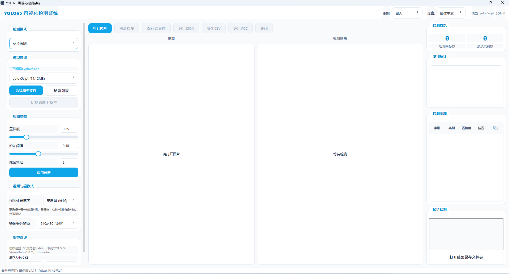
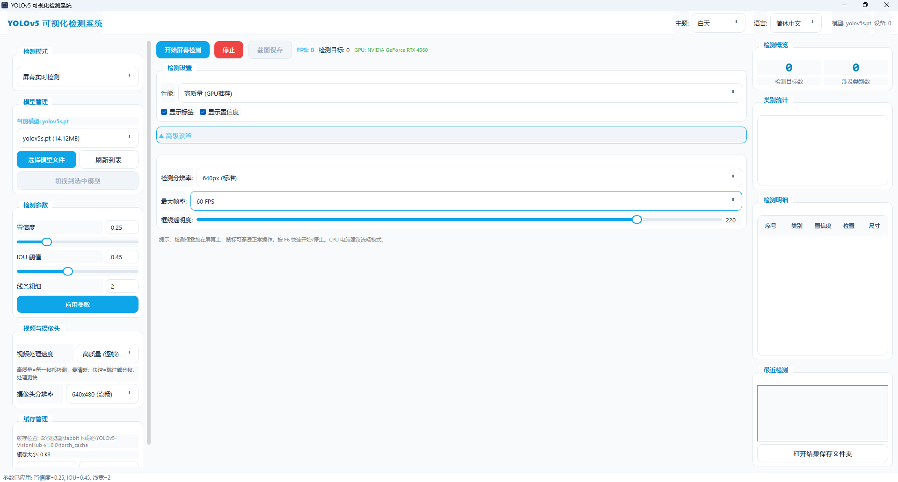

# YOLOv5-VisionHub

YOLOv5 可视化检测系统 - 桌面版目标检测工具

中文 | [English](README.md)

> **普通用户看这里：不用装任何东西！下载 Release 包，解压后双击 `YOLO检测工具.exe` 直接用。**
>
> 下面的"从源码运行"是给想改代码的开发者看的，普通用户可以忽略。

## 功能特性

- **图片检测** - 打开图片，一键检测，支持导出 JSON/CSV/VOC XML
- **视频检测** - 视频文件逐帧检测，自动保存结果视频
- **摄像头实时检测** - 调用摄像头实时检测，支持截图保存
- **屏幕实时检测** - 实时捕获屏幕内容进行检测，叠加显示检测框
- **多模型支持** - 支持 YOLOv5/v8/v9/v10/v11 模型，可加载自己训练的模型
- **多语言界面** - 支持中文、英语、日语、韩语、法语、德语、西班牙语、俄语、葡萄牙语
- **CPU/GPU 自适应** - 有 NVIDIA 显卡自动用 GPU，没有自动用 CPU
- **参数可调** - 置信度阈值、IOU 阈值、最大检测数、线条粗细
- **历史记录** - 自动记录最近检测，方便回看

## 界面截图

### 主界面


### 屏幕实时检测


## 系统要求

- Windows 10 及以上（64位）
- 内存：4GB 以上（推荐 8GB）
- GPU：NVIDIA 显卡（可选，没有也能用 CPU）

## 快速开始（普通用户）

1. 点页面右侧的 **Releases**，下载最新的压缩包
2. 解压到任意目录（路径不要有中文）
3. 双击 `YOLO检测工具.exe` 启动
4. **不需要安装 Python、PyTorch 等任何环境**

## 使用自己的模型

把训练好的 `.pt` 文件放到 `models/` 目录，重启软件，在左侧「模型管理」里选择并切换。

## Docker

想用 Docker 运行？详见 [DOCKER.md](DOCKER.md)，支持 CPU 和 GPU 两种版本。

> **注意：** Docker 镜像比 exe 包更大，因为包含了完整的系统环境。普通 Windows 用户直接用 exe 更简单更小。

## 为什么安装包这么大？

Release 包约 3GB，主要包含：
- **PyTorch + CUDA**（约2GB）：GPU加速必需，占了绝大部分体积
- **OpenCV、PyQt5 等依赖**（约500MB）
- **4个预训练YOLO模型**（约200MB）

**不需要GPU的话：** 软件会自动用CPU运行。你也可以删掉 `models/` 目录里不用的模型文件来省空间。

---

## 开发者：从源码运行

> 只有想修改代码的人才需要看这部分，普通用户直接用上面的 Release 包。

```bash
# 克隆仓库
git clone https://github.com/HAO7919/YOLOv5-VisionHub.git
cd YOLOv5-VisionHub

# 安装 PyTorch（必须先装，根据是否有GPU选择）
# CPU版:
pip install torch torchvision --index-url https://download.pytorch.org/whl/cpu
# GPU版(CUDA 11.8):
pip install torch torchvision --index-url https://download.pytorch.org/whl/cu118

# 安装其他依赖
pip install -r requirements.txt

# 运行
python main.py
```

## 项目结构

```
YOLOv5-VisionHub/
├── main.py              # 程序入口（启动画面、单实例锁）
├── main_window.py       # 主窗口界面（所有交互逻辑）
├── detector.py          # 检测引擎封装（模型加载、推理、画框）
├── screen_capture.py    # 屏幕实时检测
├── theme.py             # 主题样式（浅色/深色、弹窗动画）
├── config.py            # 配置管理
├── i18n.py              # 多语言支持（9种语言）
├── launcher.py          # 智能启动器（环境检测）
├── requirements.txt     # Python 依赖
├── run.bat              # Windows 一键启动脚本
├── start.sh             # Linux/Mac 启动脚本
├── yolov5_app.spec      # PyInstaller 打包配置
├── build_exe.bat        # Windows 一键打包脚本
├── Dockerfile           # Docker 镜像（slim版）
├── Dockerfile.lite      # Docker 镜像（alpine版，更小）
├── docker-compose.yml   # Docker compose 配置
├── DOCKER.md            # Docker 使用说明
├── .dockerignore        # Docker 构建忽略规则
├── models/              # 模型文件目录（.gitkeep占位，用户自己放模型）
├── assets/              # 图标资源
├── docs/                # 项目主页（GitHub Pages）
├── screenshots/         # 界面截图
├── .github/workflows/   # CI 自动测试
├── .gitignore
├── .gitattributes
├── LICENSE              # MIT
└── README.md
```
└── README.md
```

## 打包 exe

```bash
# 安装 PyInstaller
pip install pyinstaller

# 一键打包（自动复制模型、清理私人文件）
build_exe.bat
```

打包完成后，`dist/YOLO检测工具/` 目录就是完整的程序，直接压缩发给别人即可。别人解压后双击 exe 就能用，不需要装任何环境。

## 许可证

MIT License

本项目采用 MIT 协议，可以自由使用、修改和分发，包括商用。只需保留原始版权声明即可。

## 免责声明

本软件仅供学习和研究使用，请勿用于非法用途。
